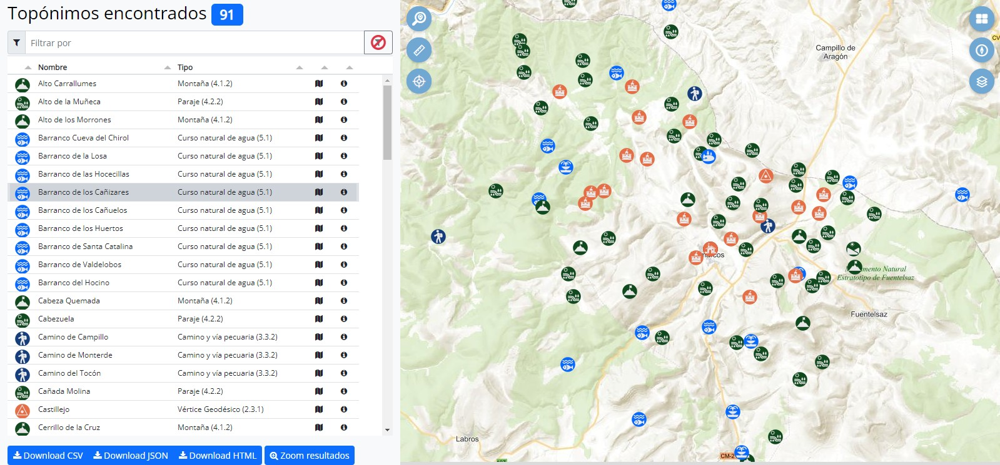
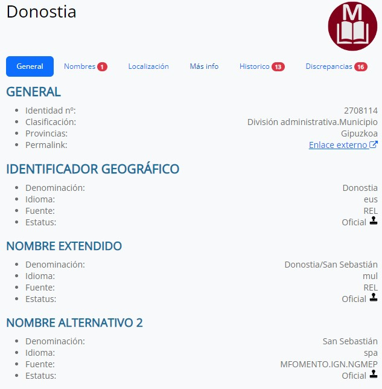
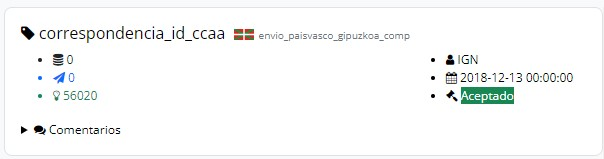
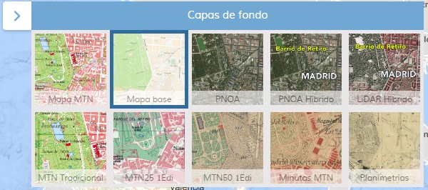

# Gazetteer NGBE

<link rel="stylesheet" href="https://maxcdn.bootstrapcdn.com/font-awesome/4.6.1/css/font-awesome.min.css">

  

Aplicación web para la consulta del **NGBE**. El Nomenclátor Geográfico Nacional se define como un registro dinámico de información que recoge las denominaciones oficiales referenciadas geográficamente que deben utilizarse en la cartografía oficial. [🌐 Web del Nomenclator en el IGN](https://www.ign.es/web/ign/portal/rcc-area-rcc)

## 🔍 Opciones de búsqueda

### 🌐 Espaciales

* Por vista del mapa: topónimos dentro del bounding Box del mapa. El entorno de búsqueda debe ser de un nivel de zoom >=13.
* Por buffer: calcula el centro del mapa y devuelve los topónimos dentro de un radio de búsqueda <= 50 Km.
  
### 🔬 Textuales

* Topónimos contenidos dentro de un municipio. Busqueda del municipio con *autocomplete*.
* Topónimos contenidos dentro de una hoja del MTN25. Busqueda de la hoja con *autocomplete*.
* Búsqueda por identificados espacial.
* Búsqueda por nombre del topónimo.
  * Cadena de texto contenida
  * Cadena de texto al principio del nombre del topónimo
  * Cadena de texto al final del nombre del topónimo
  * Cadena de texto exacta al topónimo

Los resultados pueden filtrarse por provincia o por clase.

El resultado de una consulta se muestra de manera textual en una tabla que permite búsquedas progresivas por nombre y ordenar por columna, y de manera gráfica con un mapa sobre el que se muestra un zoom general de los resultados. El mapa está desarrollado utilizando la [APICNIG](https://github.com/IGN-CNIG/API-CNIG) con algunos de sus plugins. 
Desde la tabla de resultados podemos hacer zoom a un topónimo en particular o ver su **ficha de detalle**. El resultado de la consulyta puede exportarse en varios formatos. Desde el mapa, al pinchar sobre el icono de un topónimo veremos su **ficha de detalle**, y si se trata de un cluster de topónimos,la tabla de resultados mostrará únicamente los topónimos en esa posición. Con el botón de eliminar filtro, volveremos a ver todos los resultados.

  

## 🎨 Ficha de detalle

La ficha de detalle de un topónimos nos permite estudiar todas sus características. Por motivos de interfaz de usuario, la información mostrada se ha agrupado en varias pestañas.

* **General**: se muestran los nombres y los datos principales del topónimo. También disponemos de un enlace que podemos usar para acceder directamente a esta ficha. Este enlace contiene el número de identidad, que intentifica de manera unívoca el topónimo consultado.
* **Nombres**: contiene el resto de nombres alternativos, variantes, formas recomendadas y no recomendadas, formas erróneas que tiene registradas el topónimo. Dado que son atributos que puede o no  puede tener, en la pestaña se indica con un número si algunos de ellos tiene valor asignado. En caso de valor cero la pestaña no contiene información sobre este aspecto.
* **Localización**: atributos relacionados con la ubicación del topónimo, como las coordenadas, muncipios afectados u hojas del MTN25. Los municicpios aparecen representados por su código INE y disponen de un hipervínculo, que nos llevará a otra pestaña con una búsqueda que nos muestra todos los topónimos contenidos en ese municipio.
* **Más info**: otros atributos de interé, con los temas INSPIRE, otroas codificaciones u datos del proceso de autocorrección.
* **Histórico**: muestra los cambios que ha sufrido el topónimo, la fecha del campo y el usuario detrás del cambio. En este caso junto a la pestaña se indica el número de cambios en el **LOG**, mostrándose cero si no ha habido ninguno.
* **Discrepancias**: obtenemos las discrepancias que se han recibido desde las delegaciones con respecto a los nomenclátores autonómicos. También aquí junto a la pestaña se indica el número de discfrepancias recibidas.

Cuando accedemos a la ficha de detalle de un topónimos, el mapa se centrará sobre la posición del topónimo.

  

Las discrepancias se muestran mediante una ficha donde podemos encontrar:

* Campo en el que se ha encontrado la discrepancia.
* Tabla en la que se almacena la discrepancia junto a la autonomía
* <i class="fa fa-database"></i> Valor almacenado en US2013.
* <i class="fa fa-paper-plane"></i> Valor enviado a la Autonomía.
* <i class="fa fa-lightbulb-o"></i> Valor devuelto por la Autonomía.
* <i class="fa fa-user" aria-hidden="true"></i> Usuario que valida o no el cambio
* <i class="fa fa-calendar" aria-hidden="true"></i> Fecha validación
* <i class="fa fa-gavel" aria-hidden="true"></i> Veredicto
  * Aceptado
  * Rechazado
  * Alternativo
  * Estudio

  

## Visualizador

Se ha incorporado un visualizador desarrollado con la APICNIG que permite ver los topónimos resultado de las búsquedas sobre los siguientes mapas de fondo

* Mapa MTN.
* Mapa vectorial base.
* PNOA con y sin textos.
* LiDAR con y sin textos.
* MTN Tradicional. Para acceder a este servicio es necesario instalar un plugin que desactive la petición de CORS, ya que el servicio no implementa estas cabeceras. [Este es uno](https://chrome.google.com/webstore/detail/cors-unblock/lfhmikememgdcahcdlaciloancbhjino) de los disponibles para **Chrome** y **Edge**.
* Primera edición del MTN25 y del MTN50.
* Minutas MTN (Comunmente llamado *catastrones* del MTN).
* Planimetrías del Archivo Topográfico.

  

## ⛲️ Recursos

* [✍️ Apuntes de desarrollo](develnotes.md)
* [📚 Listado de nomenclátores](lista-nomenclators.md)
* 🕵️‍♂️ Buscador de APIs: [🔗 Enlace](https://rapidapi.com/)
* 🎨 Fontawesome 4.7 [🔗 Enlace](https://fontawesome.com/v4/icons/)
* 🖼 Bootstrap 5.2 [🔗 Enlace](https://getbootstrap.com/docs/5.2/getting-started/introduction/)
* 📽 Vídeo explicación fetch [🔗 Enlace](https://www.youtube.com/watch?v=FJ-w0tf3d_w)
* 📽 Vídeo para configurar Prettier y ESLint [🔗 Enlace](https://dev.to/mrluisfer/configurar-eslint-prettier-junto-con-vscode-3h00)

