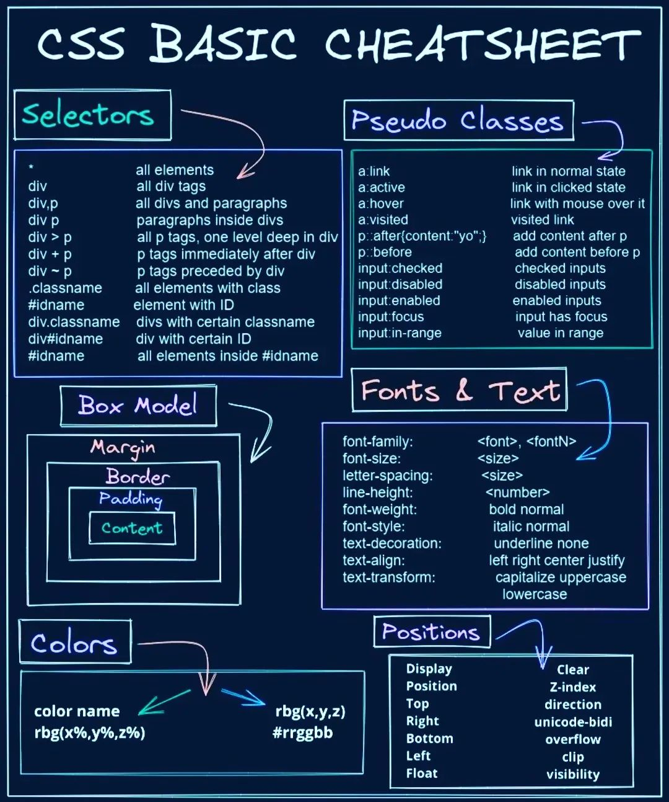

# 💻 Apuntes de desarrollo

## ⚡️ Introduciendo Vite

[**Vite**](https://vitejs.dev/config/) es un programa de generación de proyectos de frontend. Existen aplicaciones como **create-react-app** o **create-vue-app** que hacen los mismo sobre Webpack. El problema de Webpack es que tiene una curva de aprendizaje muy alta, y para proyectos grandes ralentiza mucho el trabajo. Vite no utiliza como empaquetador - *javascript bundle* - **Webpack**, sino **esBuild**. 

**esbuild** está escrito en Go. Además de templates para React o Vue, también los ofrece para Svelte o incluso para Vanilla-JS a secas, como es este proyecto. Para empezar:

```bash
npm create vite@latest vanillajs-app --template vanilla

cd vanillajs-app
npm install # Instalamos dependencias
npm run dev
  
code .  # Nos abre VsCode en la carpeta
```

Sólo con esto ya tenemos un *boilerplate* de una app con vanilla-js. Sin embargo, a mí me gusta cambiar ligeramente la estructura de carpetas; por ejemplo, todo el código fuente lo quiero colgando de `src`, quiero una carpeta `public` para las imágenes y recursos que no se instancian desde Javascript pero las quiero disponibles en la carpeta de distribución, o que la URL de salida no sea el root de la URL sino una carpeta. Todo ello puede configurarse atravñes del archivo `vite.config.js`:

```javascript
export default {
  root: 'src', // Carpeta de donde cuelga el código fuente y que Vite lanza en modo desarrollo
  build: {
    outDir: '../dist',  // Donde se compila, relativa con respecto al source code
  },
  publicDir: '../public', // Donde se introducen recursos no compilables ni hasheables
  base: '/runtime/gazetteerngbe/', // Carpeta relativa del servidor de producción. Por defecto es / (slash)
}
```

## ⚙️ Apuntes de Javascript

### Trabajando con módulos

* Un *export default* por módulo
  * Los import de una función export default non necesitan el nombre entre *curly brackets* `{…}`.
* Todos los *export* que se quieran
  * Los import de modulos con funciones export llevan nombres de las funciones entre *curly brackets*.
* Para importar todas las funciones de un mósulo, usar un alias

```javascript
// Opción 1
export const foo1 = () =>{};
export const foo2 = () =>{};

// Opción 2
const foo1 = () =>{};
const foo2 = () =>{};
export {foo1, foo2};

// Opción 3
const foo1 = () =>{};
const foo2 = () =>{};
const recursos = {
  foo1,
  foo2,
}
export default recursos;


import { cargarDiccionarioNGBE, cargarProvincias } from "./datasets"; // Estas funciones están definidas como export
import foo from ".module"; // La función foo está definida como export default
import * as mapUtils from './apicnigUtils'; // usamos las funciones así: mapUtils.map mapUtils.centrarToponimo()
```


## 🎨 Apuntes de CSS




## ⚙️ Utilizando **localStorage** y prefetch

Así obtenemos todas las claves almacenadas en `localStorage`

```javascript

for (var i = 0; i < localStorage.length; i++) {   
    key = localStorage.key(i);
    console.log(key)

}

// Así obtenemos el valor a sociado a una clave
value = localStorage.getItem(key);

// Así eliminamos la almacenada en una determinada clave
localStorage.removeItem(key); 

```

En nuestro caso, la librería **typeahead** almacena en el localStorage los arrays con los valores para mostrar en el autonumérico. Para el caso del municipio, el HTML y el Javascript son:

```html
<input type="text" id="muniselect" name="muniselect" class="combomunis" placeholder="Introduce un municipio y pulsa buscar">
```

```javascript
$('#muniselect').typeahead({
name: 'combomunis',
prefetch : 'http://localhost/apibadasidv4/public/autoridades/municipios'
});
```

Esto genera una clave en el **localStorage** llamada *__combomunis__itemHash* que almacena los valores retornados por la llamada a la API BADASID. Para borara de la caché estos valores, podemos usar:

```javascript
localStorage.clear(); /* Borra todo lo allacenado en localStorage */ 
localStorage.removeItem('__combomunis__itemHash'); /* Borra úncaimente valores de la clave */
```

### ☂️ Motivos del cambio de la librería TypeAhead por AutoComplete

Para el componente Autocomplete, he descartado la librería [**Typeahead**](https://github.com/twitter/typeahead.js) porque necesita de **jQuery** para su funcionamiento, y quería hacer un desarrollo libre de esta dependencia. En su sustitución, he utilizado la librería [**autoComplete**](https://github.com/TarekRaafat/autoComplete.js) que utiliza exclusivamente **Vanilla JS**.

Dentro de la carpeta `vendor\autoComplete@10.2.7` está la versión descargada de la librería con sus posibles hojas de estilo y un fichero `pruebas.html` que utilizo como pruebas.


## ⚙️ Uso de fetch en peticiones API

AJAX correponde a la abreviatura de **Asynchronous JavaScript and XML**. AJAX es una técnica de desarrollo web que nos permite actualziar el contenido de una web sin recargar la página completa.
El XML presente en el nombre se debe a aque inicialmente las transferencias de datos se hacían utilizaban este lenguaje de marcado. Hoy en día, este formato ha sido sustituído mayoritariamente por JSON.
Javascript tiene un objeto llamado XMLHttpRequest() que podemos utilizar para hacer estas peticiones. Sin embargo, su complejidad fue unos de los motivos por los que **jQuery** se hizo tan popular, ya que simplificaba
las llamadas.

Actualmente lo mejor es utilizar **Fetch API**. La API Fetch proporciona una interfaz para recuperar recursos. Fetch devuelve una promesa, que tenemos que manejar. Esta respuesta que devuelve, contiene entre sus propiedades un *status* para comprobar cómo ha ido la petición, y un **body**, que es una clase ReadableStream.

```javascript  
const options =  {
        method:'GET', /* Por defecto, pero lo pongo como dejemplo de cómo se puede parametrizar */
}

fetch(urlRequest,options)
  .then(res => res.json()) /* Retorno implícito de un arrow function */
  .then(response =>{
    console.log(response);
    showResultsetList(response);
  })
  .catch(err=>{
    console.log(err);
  });


fetch(urlRequest,options)
  .then(res => {
    /* Retorno explícito de un arrow function */
    // Comprobamos el valor de un header en particular 👇
    console.log(res.headers.get("Content-Type")); 
    // Listamos todos los headers recibidos 👇
    for (const [key, val] of response.headers){ 
      console.log(key,val)
    }
    return res.json()
  })
  .then(response =>{
          console.log(response);
          showResultsetList(response);
  })
  .catch(err=>{
          console.log(err);
  });
```

Esto que vemos aquí es una petición GET, pero podemos mandar una petición POST

```javascript
// Los datos que queremos enviar
const payload ={
  id: 1354654,
  name: "Esteban",
  color: "red",
}

const options = {
  method: "POST",
  headers: {
    "Content-type": "application/json; charsert=UTF-8"
  },
  body: JSON.stringify(payload),
}


fetch(url, options)
    .then(res => console.log(res)) /* Retorno implícito de un arrow function */
    .catch(err=>{
      /* Retorno explícito de un arrow function */
      console.log(err);
    });
```

# Fuentes

https://www.youtube.com/watch?v=J_ZmtP9xNg8

Consulta para sacar la relación NGMEP-NGBE

select entidadesngmep.* 
from ngbe_elaboracion.entidadesngmep 
where entidadesngmep.identidad in (select regexp_split_to_table(identidad_ngmep,',')::integer from ngbe_elaboracion.ngmep_to_ngbe WHERE id_ngbe='2707911');

https://www.youtube.com/watch?v=J_ZmtP9xNg8